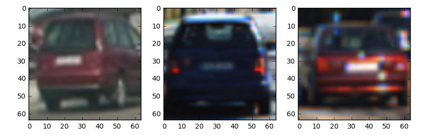
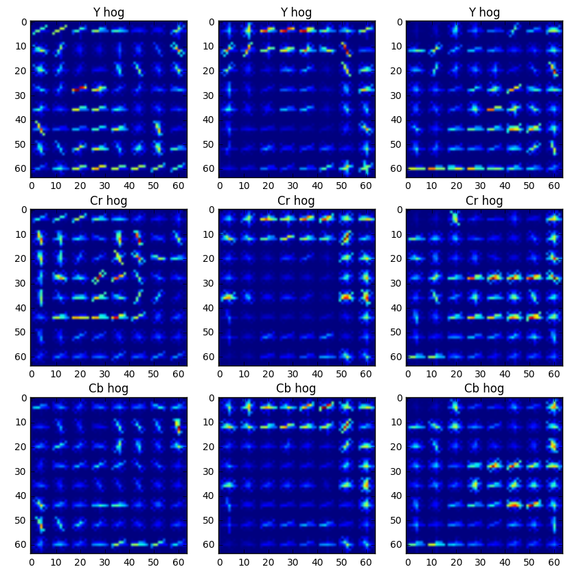
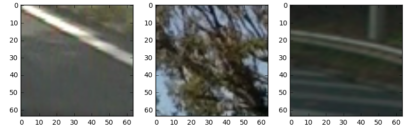
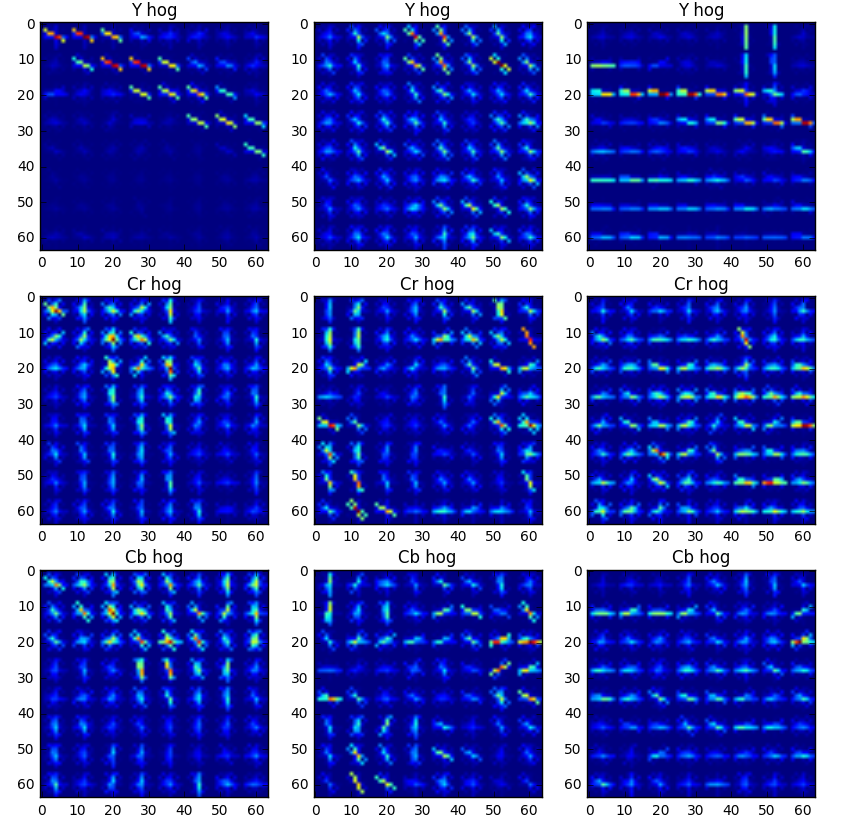
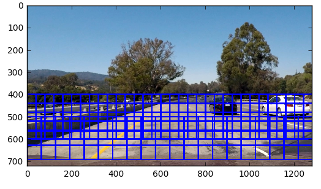
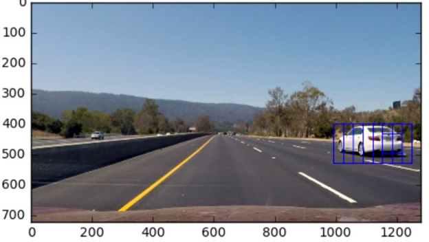
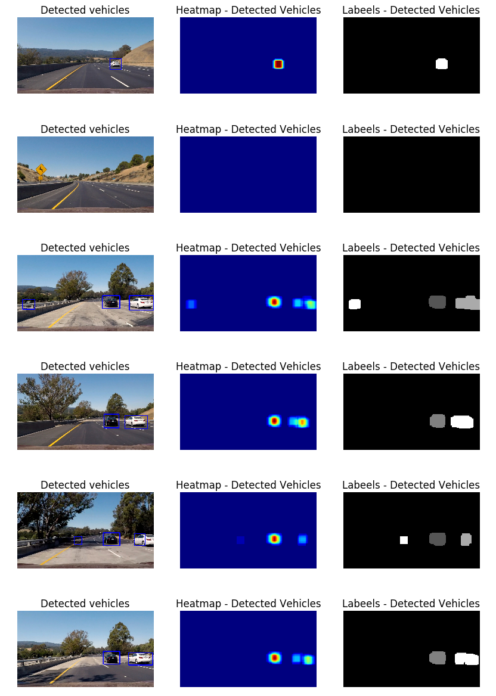

# Vehicle Detection

The objective of this project is to train a classifier to detect cars, and stream-line it to work on a video input. In the next sections of this write-up we cover the code provided in the jupyter notebook, which represents the pipeline for detecting the images.

The helper functions below were re-utilized from the course material: 

```python
color_hist(img, nbins=nbins, bins_range=bins_range)

bin_spatial(img, size=spatial_size)

extract_features(imgs, color_space=color_space, spatial_size=spatial_size,
                     hist_bins=hist_bins, orient=orient,
                     pix_per_cell=pix_per_cell, cell_per_block=cell_per_block,
                     hog_channel=hog_channel, spatial_feat=spatial_feat, 
                     hist_feat=hist_feat, 
                     hog_feat=hog_feat)

slide_window(img, x_start_stop=[None, None], y_start_stop=[None, None],
                 xy_window=(64, 64), xy_overlap=(0.5, 0.5),window_list=None)

search_windows(img, windows, clf, scaler, color_space=color_space,
                   spatial_size=spatial_size, hist_bins=hist_bins,
                   hist_range=hist_range, orient=orient,
                   pix_per_cell=pix_per_cell, cell_per_block=cell_per_block,
                   hog_channel=hog_channel, spatial_feat=spatial_feat,
                   hist_feat=hist_feat, hog_feat=hog_feat)

single_img_features(img, color_space=color_space, spatial_size=spatial_size,
                     hist_bins=hist_bins, orient=orient,
                     pix_per_cell=pix_per_cell, cell_per_block=cell_per_block,
                     hog_channel=hog_channel, spatial_feat=spatial_feat, 
                     hist_feat=hist_feat, 
                     hog_feat=hog_feat)

add_heat(heatmap, bbox_list)

apply_threshold(heatmap, threshold)

draw_labeled_bboxes(img, labels)
```


First, we pre-process images (if needed) and extract Spatial and HOG features from a labeled training set of [cars](https://s3.amazonaws.com/udacity-sdc/Vehicle_Tracking/vehicles.zip) and [non-cars](https://s3.amazonaws.com/udacity-sdc/Vehicle_Tracking/non-vehicles.zip) image. Since the images are in PNG format and we use the matplotlib.image imread function, which normalizes pixel intensity values, there would be no need for normalizing this set of images, unlike the case for the test set and video stream.

After that, we go over normalization of the features and fitting a Scaler to the data, before training a linear SVM model using these normalized features. This normalization will guarantee the same range of values of all inputs to the SVM model.

Then we describe the pipeline for detecting vehicles in a test set: We are provided with a group of test images from a camera mounted on the front of a car. We discuss how the above methods will be used to design a sliding window search method that searches for cars in a ROI in the image and show the results in terms of a heat map.

Finally, we apply the pipeline on a video stream, and go over extension methods for stability of the bounding boxes around detected vehicles in consecutive frames.


## HOG and Spatial Features
---

There are multiple features that can be used, such as SIFT, SURF and HOG features, in addition to color-dependent/intensity-dependent features. Another option is to rely on a deep learning model that automatically comes up with its set of features.

In this work, I use HOG features to train the classifier. HOG features produce a distinctive signature of gradient orientations for an object, and the performance of the classifier highly relies on how distinctive these features are. [Link to the paper](http://vc.cs.nthu.edu.tw/home/paper/codfiles/hkchiu/201205170946/Histograms%20of%20Oriented%20Gradients%20for%20Human%20Detection.pdf) for more details about how it works. Using this feature requires experimenting with the parameters: The number of bins for the orientation histogram, pixels per cell etc. These parameters need to be chosed in a way to produce good features.

```python
from skimage.feature import hog
hog(img, orientations=orient,
	pixels_per_cell=(pix_per_cell, pix_per_cell),
    cells_per_block=(cell_per_block, cell_per_block),
    transform_sqrt=True,
    visualise=vis, feature_vector=feature_vec)

```

The figure below shoes 3 random car images, and their corresponding HOG features for each channel in the YCrCb color space:





And here are some HOG features for 3 random non-car images





In addition to HOG we use Spatial features, which is the binned color features.

```python
def bin_spatial(img, size=spatial_size):
    features = cv2.resize(img, size).ravel()
    return features
```


The parameters used are as follows:

```python
color_space = 'YCrCb'  # Can be RGB, HSV, LUV, HLS, YUV, YCrCb
orient = 18  # HOG orientations
pix_per_cell = 8  # HOG pixels per cell
cell_per_block = 2  # HOG cells per block
hog_channel = "ALL"  # Can be 0, 1, 2, or "ALL"
spatial_size = (64, 64)  # Spatial binning dimensions
nbins = 32
hist_bins = 64  # Number of histogram bins
hist_range = bins_range = (0,256)
spatial_feat = True  # Spatial features on or off
hist_feat = False  # Histogram features on or off
hog_feat = True  # HOG features on or off
```

First, all the car/non-car images are read:

```python
car = glob.glob('vehicles/*/*.png')
noncar = glob.glob('non-vehicles/*/*.png')
total = car + noncar
cars = []
notcars = []
for image in car:
    cars.append(image)
for image in noncar:
    notcars.append(image)
```

Training images are of size 64x64x3. After that we get the HOG features for each image using the helper method:

```python
def extract_features(imgs, color_space=color_space, spatial_size=spatial_size,
                     hist_bins=hist_bins, orient=orient,
                     pix_per_cell=pix_per_cell, cell_per_block=cell_per_block,
                     hog_channel=hog_channel, spatial_feat=spatial_feat, 
                     hist_feat=hist_feat, 
                     hog_feat=hog_feat):
```

The extracted features are pickeld in feat.pkl for easier retrieval on next iterations.                             

## Model Training
---

Before training the model, we standardize the features by removing the mean and scaling them to unit variance. For that we use:

```python

# Create the training data
X = np.vstack((car_features, notcar_features)).astype(np.float64)
from sklearn.preprocessing import StandardScaler
X_scaler = StandardScaler().fit(X)
scaled_X = X_scaler.transform(X)
```

After that we split the data into 85% training and 15% validation:

```python
X_train, X_test, y_train, y_test = train_test_split(scaled_X
                                                    , y
                                                    , test_size=0.15
                                                    , random_state=20)
```

Now we create a model object, train it and see the validation score: 

```python
# Create a Linear SVC Object
svc = LinearSVC()
    
# Fit the model to the training data
t = time.time()
svc.fit(X_train, y_train)
t2 = time.time()
print(round(t2 - t, 2), 'Seconds to train SVC...')

# Check the score of the SVC on the holdout set
print('Test Accuracy of SVC = ', round(svc.score(X_test, y_test), 4))

# Check the prediction time for a single sample
t = time.time()
```

The model has about 99% accuracy on the validation set.

#### Sliding-Window Search Pipeline

The view field of the car, captured by the installed camera on the front contains a wide area spanning the street, trees on the side and the sky. To decrease the time spent searching for cars, we limit the region of interest to fall in the bottom half of the image.

Also, cars have different sclales. The sliding window method will create a set of windows, with a specific overlap (90% in both dimensions) and size (80x80). Each window gets normalized before HOG features are extracted. Then we standardize these features and feed them to the trained model to make a prediciton. The search function returns a list of bounding boxes for which the model predicted a vehicle. The figure below shows how the slide_window method works to produce a set of boxes, on different scales, to be searched for cars:



And here is the corresponsing code:

```python
img = mpimg.imread("test_images/test1.jpg")
img_norm = img.astype(np.float32)/255
windows_80 = helpers.slide_window(img_norm, x_start_stop=[None, None], y_start_stop=[400,600]
                                          , xy_window=(80, 80), xy_overlap=(0.50, 0.50))
windows_128 = helpers.slide_window(img_norm, x_start_stop=[None, None], y_start_stop=[500,720], 
                    xy_window=(128, 128), xy_overlap=(0.50, 0.5))
windows = windows_80 + windows_128
```

This workflow results in two main issues:

* False Positives: Windows where the model detected a car while none existed.
* Combining multiple detections for the same car due to window overlap.
* Stability of the bounding boxes between consecutive frames.

In order to reject false positives, we apply a heat map, which increments pixels that happen to fall within a bounding box of a vehicle (windows where the model predicted a vehicle), and then we apply a threshold there, by assigning zero value to all pixels except the ones that have been classified as part of a vehicle more than x times, where x is a threshold.

```python
def add_heat(heatmap, bbox_list):
    for box in bbox_list:
        heatmap[box[0][1]:box[1][1], box[0][0]:box[1][0]] += 1
    return heatmap


def apply_threshold(heatmap, threshold):
    heatmap[heatmap <= threshold] = 0
    return heatmap
```

For the overlapping detections for the same car, such as in the image below, we would like to combine all these detections into one bounding box. This is achived by having the bounding box surround the heat area associated with that car, since all these overlapping windows have the same label. This is implemented in the method

```python
def get_hot_windows(image, previous=None, count=0)
```




When the pipeline applied on the set of test images, the following bounding boxes are produced. The original image with the bounding box - after tackling the issue of overlapping windows - is to the left. In the middle, the heat for each pixel is shown, based on the number of positive window each pixel has been part of. To the right, we apply the scipy function

```python
scipy.ndimage.measurements.label(heat)
```

On the heat map, which provides a label for each detection: aka each squarely-connected group of non-zero pixels. Each label is a specific level of gray scale.




## Application on Video Stream
---
